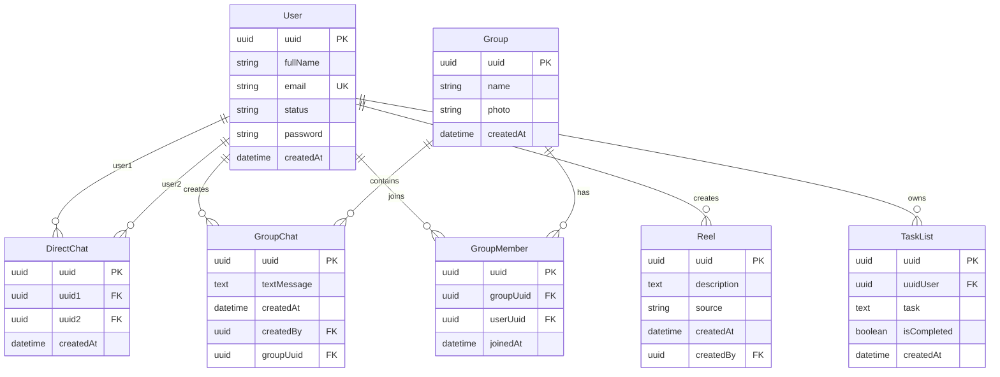

# Entity Relationship Diagram (Mermaid)

## Relationships Explained

### User Relationships

- **User ↔ DirectChat**: A user can be part of multiple direct chats (as user1 or user2)
- **User ↔ GroupMember**: A user can join multiple groups
- **User ↔ GroupChat**: A user can create multiple group chat messages
- **User ↔ Reel**: A user can create multiple reels
- **User ↔ TaskList**: A user can have multiple tasks

### Chat Structure

- **DirectChat**: Represents the conversation container between two users (1-on-1)
- **Group ↔ GroupMember**: A group can have multiple members
- **Group ↔ GroupChat**: A group conversation contains multiple group chat messages

### Key Points

- `GroupMember` table manages group membership (many-to-many relationship between User and Group)
- `GroupChat` table is for **group messages** in groups
- `DirectChat` represents the conversation container between two users
- `Group` represents the conversation container for multiple users
