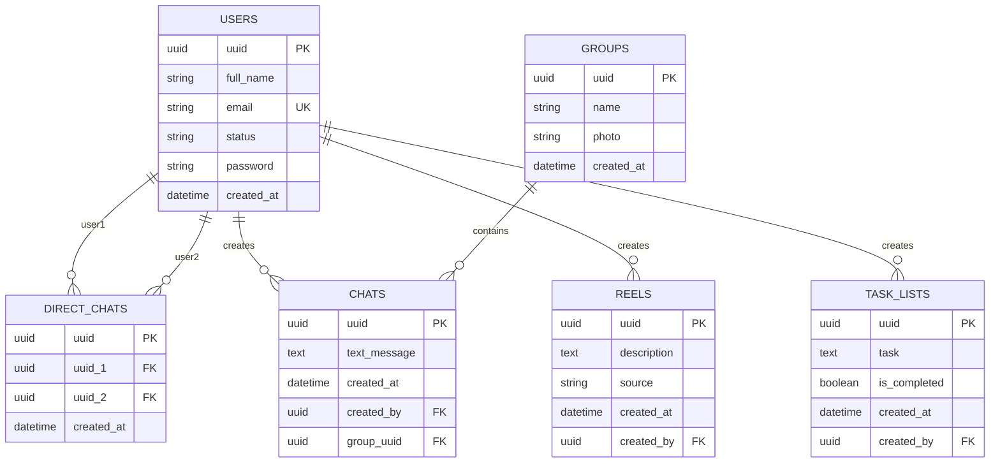

# Entity Relationship Diagram

## Relationships

### USERS

- **1:N** with DIRECT_CHATS (as user1)
- **1:N** with DIRECT_CHATS (as user2)
- **1:N** with CHATS (creator)
- **1:N** with REELS (creator)
- **1:N** with TASK_LISTS (creator)

### DIRECT_CHATS

- **N:1** with USERS (uuid1)
- **N:1** with USERS (uuid2)

### GROUPS

- **1:N** with CHATS

### CHATS

- **N:1** with USERS (creator)
- **N:1** with GROUPS (optional)

### REELS

- **N:1** with USERS (creator)

### TASK_LISTS

- **N:1** with USERS (creator)

## Key Points

1. **Cascade Delete**: When a user is deleted, all their related data (chats, reels, tasks) are also deleted
2. **Optional Group**: Chats can exist without a group (for direct messages)
3. **Unique Constraint**: Direct chats ensure no duplicate chat rooms between same two users
4. **UUID Primary Keys**: All tables use UUID for better distribution and security
5. **Timestamps**: All tables have created_at for audit trail
